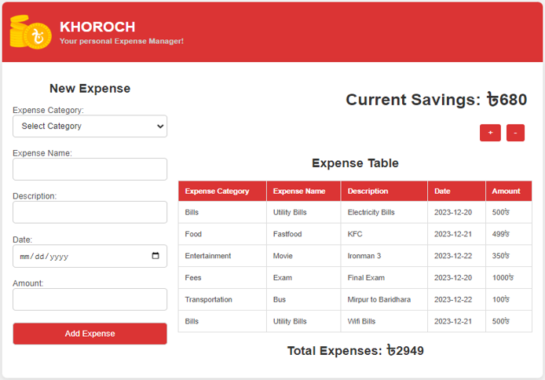

# KHOROCH - Expense Manager

  

## Overview

**Khoroch** is a modern web-based application designed to simplify personal finance management. It empowers users to effectively track and organize their daily expenses with an intuitive and user-friendly interface. By leveraging cutting-edge technologies, Khoroch ensures a seamless experience for users seeking to gain better control over their finances. 

## Key Features  

- **Add Expenses**: Log expenses and categorize them effortlessly.  
- **Expense Table**: View all expenses in a structured table.  
- **Total Expense**: Automatically calculate total spending.  
- **Savings Tracker**: Track savings after deducting expenses.  

## Technologies Used  

- **Backend**: Spring Boot  
- **Frontend**: React, HTML, CSS  
- **Database**: MySQL  
- **Version Control**: Git  
